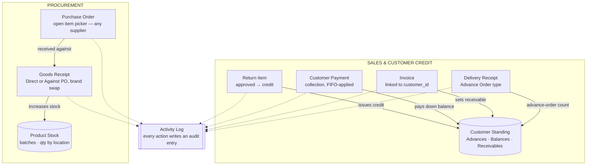

# Session Summary — For Client Meeting Reference

**Purpose of this file:** not a system architecture doc (the old version of this file described a much
older, single-table stock system that no longer exists). This is a recap of everything worked on across
this session, organized by initiative, written for meeting prep — what changed, why, and what's still
pending a decision or sign-off from the client ("Sir").

**Branches involved:** `feature/audit-logs` (pushed, all commits in) and `feature/customer-credit-flow`
(pushed, branched off `feature/audit-logs` since it depends on the logging mechanism built there). Neither
is merged to `main` yet.

---

## Session Data Flow

Two business flows ran through this session's work: **Sales & Customer Credit** determines what a
customer owes, **Procurement** determines what's in stock. Both are cut across by the **Activity Log**
(dashed lines) — the refactor that made every one of these six actions leave an audit trail, where before
only login/logout did.

---

## 1. Activity Log Refactor

**Why:** the app only ever logged login/logout. Every other action — creating a customer, adjusting stock,
approving a return, suspending a user account — left no trace. That's a real audit-trail gap for a
pharmacy inventory system.

**What was built**, in 6 phases (each verified live and checked in on before moving to the next):

- A single centralized logging mechanism (`ActivityLog::record()`) that every part of the app now calls
  the same way — module, action, who did it, what record it affected, and a before/after snapshot when
  something was updated.
- **Phase 2–3:** logging added to every core module — Customers, Suppliers, Products, Categories, Taxes,
  Sales Orders, Delivery Receipts, Invoices, Purchase Orders, Goods Receipts, Inventory Adjustments, Stock
  Transfers, Stock Disposals, Expenses, Return Items.
- **Phase 4:** POS-side logging — every completed sale, whether from the POS terminal or the admin
  "direct sale" screen.
- **Phase 5:** security-relevant events that weren't tracked at all before — failed login attempts,
  forced logout when an account gets suspended mid-session, password reset requests/completions, and
  account suspend/reactivate actions.
- **Phase 6:** the admin Activity Log viewer now has real filters (user, module, source, date range) and a
  details view showing exactly what changed on an update — previously it was one long unfilterable list.

**Bugs found along the way (documented, not fixed — out of scope for this refactor, flagged for a
separate pass):**
- A customer can crash the page (500 error) if "Customer Type" is left blank — the database requires it
  but the form doesn't.
- Approving/rejecting a Return Item redirects to a page that doesn't exist, even though the action itself
  completes successfully underneath.

---

## 2. Customer Money Columns — Advances, Balances, Receivables

**Why:** the Customer list showed "Advances," "Balances," and "Receivables (PHP)" columns, but the numbers
were wrong — computed from manually-entered payment records and a loose text match between invoices and
customer names, not from anything that actually reflects what a customer owes.

**What was confirmed with the client mockup and built:**
- **Advances** = how many Delivery Receipts a customer has that were made *without* a Purchase Order
  first (the "urgent order" flow) — a count, not a peso figure.
- **Balances** = how many of a customer's invoices still have money owed on them — also a count.
- **Receivables (PHP)** = the actual peso total still owed, summed across those unpaid invoices.

To make Receivables accurate, invoices needed a real link to a customer record — previously it was just a
typed-in name with no guarantee it matched anything. That's fixed now (existing invoices were matched up
automatically; a handful with no exact name match were left unlinked and logged for manual review).

**Additional pieces built on top of this** (client hasn't explicitly asked for these yet, but they were a
natural extension of fixing the payment/balance tracking):
- When a customer pays more than one invoice's worth at once, the extra automatically applies to their
  *next* oldest unpaid invoice instead of just sitting there.
- Approving a Return Item can now credit the customer's account for that item's value — that credit then
  automatically applies to their *next* invoice.
- Customer management (view, create, record payments) is now available to regular staff, not just admins
  — matching how Invoices/Sales Orders/Delivery Receipts already work.

**Still needs client confirmation:** the "Balances" formula (count of unpaid invoices) is our own
interpretation — only "Advances" has been explicitly confirmed by Sir so far.

---

## 3. Purchase Order → Goods Receipt Workflow Fixes

Three specific issues Sir flagged after using the system:

1. **Purchase Order item picker was too restrictive.** It only showed items already assigned to whichever
   Supplier was selected — so items without a supplier assignment silently disappeared from the list.
   Fixed: any item can now be added to a PO regardless of supplier.

2. **Goods Receipt "Against Purchase Order" had no way to record a substitute brand.** A PO might be
   raised for one brand of a product, but the supplier sometimes delivers a different brand of the same
   generic item. There was no way to record that — the system just assumed whatever brand the PO
   specified. Fixed: a Brand field was added to each pending line, letting the receiver pick a different
   brand under the same generic item if that's what actually arrived. (Scope confirmed with Sir: for now,
   restricted to brands of the *same* generic item as the PO line — opening it to the full catalog is a
   quick follow-up once/if Sir wants that.)

3. **"Item Description" wasn't showing the actual item description.** Several screens (Products list,
   item search fields in Goods Receipt, Purchase Order, Invoice, and Inventory Adjustment) were all
   displaying an auto-generated "Generic Name (Brand)" label instead of the real description text typed
   into the product's own form. Fixed across all five screens.

---

## 4. Deployment Fix (Railway / SQLite)

A migration used raw SQL that only works on MySQL/Postgres, which crashed on Railway's SQLite database
during a test deploy. Rewritten to use Laravel's portable migration syntax instead — works the same on
whichever database engine is actually in use. Fixed directly on `main` since it was a deployment blocker.

---

## 5. Smaller Fixes

- "Generate N Lines" cap (Sales Order, Delivery Receipt, Inventory Adjustment, Stock Disposal) raised from
  50 to 100 — client's real orders regularly exceed 60 lines.
- Customer list UI: Advances/Balances now shown as badges instead of plain numbers, hover tooltips added
  explaining what each column actually counts, Customer Type formatted more readably, Receivables bolded
  with a currency symbol.

---

## Open Items for the Meeting

- **Balances formula** — confirm the "count of unpaid invoices" interpretation is correct.
- **Goods Receipt Brand field scope** — confirm whether it should eventually open to the full product
  catalog (not just the same generic item) once Sir has used the current version.
- **Two pre-existing bugs** found during the Activity Log work (Customer Type validation gap, Return Item
  redirect bug) — not fixed yet, flagged for a separate pass whenever convenient.
- Both feature branches (`feature/audit-logs`, `feature/customer-credit-flow`) are complete and pushed but
  not yet merged to `main` — merge timing is a business decision, not a technical blocker.
