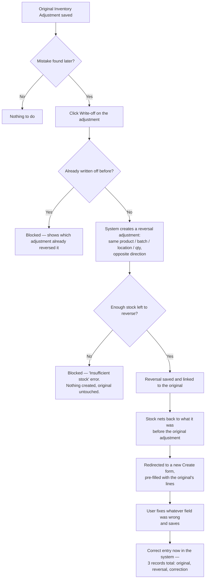

# Inventory Adjustment — Edit / Delete / Print

**Status: all three built and live (2026-08-13).**

## Why Edit/Delete needed more thought than the others

Once an Inventory Adjustment is saved, it **immediately changes the stock count** — same as Goods
Receipt and Delivery Receipt already do. There was no "undo" for that at all before today.

## What got built (Option A, confirmed with the client)

- **Edit** — still "not supported": the button exists (mirrors Goods Receipt/Delivery Receipt), but
  clicking it just shows a message and sends you back to the adjustment. Nothing about the stock or the
  record itself ever changes here.
- **Write-off** (in place of Delete) — the client's actual ask: a safe way to correct a mistake without
  editing line-by-line. One click creates a new, opposite-direction Inventory Adjustment that exactly
  reverses the original's lines (same product/batch/location/qty), then redirects to a fresh Create form
  pre-filled with those same lines so the correct entry just needs the wrong field fixed. The original
  record is never touched — only new, additive records get created. Reuses the existing
  `InventoryAdjustmentService::createAdjustment()` for the actual stock movement, so the existing
  insufficient-stock protection (`StockService::deduct()`) applies automatically: if the original's
  stock was already consumed elsewhere before someone tries to write it off, the attempt fails cleanly
  with a clear error instead of corrupting anything. A `reverses_adjustment_id` link ties the two
  records together (shown as a banner on both), and a second write-off attempt on the same original is
  blocked.
- **Print** — built earlier the same day, using Invoice's letterhead layout as the template.

## Write-off flow

Two important guardrails baked into this flow: (1) an adjustment can only ever be written off once —
trying again just shows which reversal already covers it; (2) if the stock that adjustment added has
already been consumed by something else (sold, moved, disposed) before the write-off is attempted, the
whole thing fails cleanly with an "Insufficient stock" message instead of silently creating a wrong
number.

**Separate, simpler path for pure typos** (wrong Batch No. or Expiration Date, correct quantity): use
the direct Edit action on the batch itself (Lot/Serial & Expiry tab) instead of Write-off — no stock
movement involved at all, see below.

## Also built: direct Batch No. / Expiration Date edit

While exploring the write-off workflow, found a real gap: a typo'd expiry baked into a *newly created*
batch couldn't actually be fixed by write-off-and-redo, since re-entering the same batch_no just reuses
the batch's already-wrong stored expiry (the corrected value gets silently ignored). Fixed by adding a
small, direct edit for a batch's Batch No. and Expiration Date on the Lot/Serial & Expiry tab — pure
metadata, `StockService` never reads either column, so this never touches quantities/location_stocks.
Also cleanly handles the batch-no-typo case (e.g. a mistyped letter "O" instead of zero), which
otherwise worked fine via write-off-and-redo but is simpler to just fix directly.

## Verification

Live-tested end to end with temp records: multi-line write-off (stock nets back to exactly zero on both
lines), double-write-off correctly blocked, a simulated "stock already consumed elsewhere" scenario
correctly fails with a clear insufficient-stock error and creates nothing partial, Edit still bounces
back as not-supported, batch edit persists and leaves stock completely untouched, and a batch_no
collision within the same product is correctly rejected. All test data cleaned up and confirmed removed
afterward.
